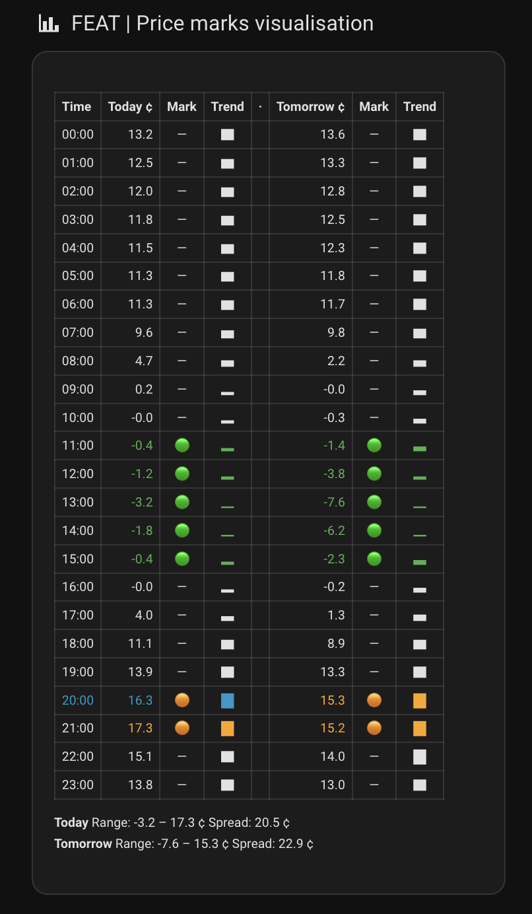

# HBA vs HBC — Differences

This document covers how Home Battery Assistant (HBA) differs from the original
[Home Battery Control (HBC)](https://github.com/gitcodebob/marstek-venus-rs485-node-red)
project. It is aimed at HBC users who want to understand what changed, and at anyone
curious about the design trade-offs made in the HA-native port.

For HBC users installing HBA alongside HBC, see also the
[For existing HBC users](README.md#for-existing-hbc-users) section in the README.

---

## The fundamental difference: no Node-RED

HBC runs its control logic in Node-RED flows. HBA replaces those flows entirely with
native HA automations and scripts. From the battery's perspective, the commands are
identical — the same Modbus writes, the same strategy logic, the same PID algorithm.
What changes is where that logic lives.

Practical consequences:

- **No Node-RED installation required.** The only runtime is Home Assistant itself.
- **State survives restarts.** Node-RED stores PID state (I-term, timestamps, etc.) in
  flow context, which is lost when Node-RED restarts. HBA stores everything in
  `input_number` and `input_datetime` helpers, which HA restores from `.storage/` on
  every restart. The I-term in particular — losing it means the battery starts from zero
  integration and overshoots until it builds up again. HBA never loses it.
- **No rate limiter.** HBC has an "operational thresholds" gate that skips the PID cycle
  when P1 changes less than 20 W and less than 2% from the previous reading. HBA has
  no equivalent — it runs on every P1 update (subject only to the 15 W deadband). This
  is the most significant behavioural difference; see [PID behaviour](#pid-behaviour) below.

---

## PID behaviour

The PID algorithm is a direct port of HBC's implementation. The parameters (Kp, Ki, Kd,
error dampening, output dampening, hysteresis) are identical in meaning and work the same
way. However, one structural difference affects how the controller feels in practice.

### HBA runs the integrator more often

HBC skips the entire PID cycle — including the integrator — when P1 is stable (< 20 W
and < 2% change from the previous reading). HBA has no such gate; it runs on every P1
update. With a 1 s DSMR meter, this means HBA can accumulate I-term up to 20× more
frequently during a stable period than HBC does.

**Effect:** the same Ki value is more aggressive in HBA than in HBC, particularly
during stable, low-error periods where the integrator has time to wind up.

**If you are migrating PID values from HBC:** start with a lower Ki and tune from there.
The [docs.homebatterycontrol.com/04-setup-self-consumption](https://docs.homebatterycontrol.com/04-setup-self-consumption)
page covers tuning in general. The HBA-specific starting point is to halve your HBC Ki
and observe.

### P1 update rate matters

HBA runs at whatever rate the P1 sensor updates. DSMR 5.0 meters update every 1 s;
older meters may update every 3–10 s. At slower update rates the integrator accumulates
more slowly and HBA behaves more conservatively — closer to HBC's behaviour. The Ki
warning above is most relevant for 1 s meters.

### Built-in presets

**Very safe**, **Safe**, and **Regular (original HBC)** are carried over from HBC.
HBA introduces a new **Regular** preset with values that appear to work better in
practice — it is still under review. The original HBC Regular preset is preserved
as **Regular (original HBC)**. Treat all presets as starting points, not tuned
recommendations.

### Other PID differences

| Aspect | HBC | HBA |
|---|---|---|
| Derivative term | On measurement: `Kd × -(P1 − P1_last)` | On error: `Kd × (err − prev_err)` — mathematically equivalent for a constant setpoint |
| Direction-flip guard when triggered | Locks to previous direction at full PID magnitude | Sets output to 0; battery idles at 1 W hold |
| SoC cutoff boundary | Exact: `soc >= soc_max` | ±0.5% buffer to prevent relay chatter at the exact boundary |
| Slow charge thresholds | Hard-coded: ≥ 95% → 1500 W; ≥ 99% → 1000 W | Configurable in Advanced Settings (same defaults) |

---

## Feature additions

These are features HBA has that are not in HBC:

| Feature | Notes |
|---|---|
| **Battery connectivity validation** | Onboarding wizard verifies Modbus communication for each battery before going live |
| **Availability gates** | Template `select` entities on m2–m6 gate Modbus polling behind `hba_battery_count` — prevents log flooding when fewer than 6 batteries are configured |
| **Conflict detection** | Fires automatically if HBA and HBC both end up in Full control simultaneously; disables HBA and creates a persistent HA notification |
| **HBC coexistence panel** | Dashboard buttons to hand control between HBA and HBC (Take control / Yield to HBC) |
| **Configurable Frank Energie entity ID** | Set in Advanced Settings — see [Dynamic pricing](#dynamic-pricing) below |
| **Insights view** | Live flow trace showing the active strategy chain (e.g. `Dynamic → Charge PV → Self-consumption (charge only)`). Replaces HBC's Node-RED context trace |
| **Peak shaving — all strategies** | HBC applies peak shaving only in the partials flow (Charge PV, Zero import, Standby). HBA integrates it into `self_consumption`, so Timed and Dynamic also inherit it automatically |

---

## Dynamic pricing

Both Dynamic v1 and v2 are direct ports of HBC's algorithms — logic, marks format, and
sub-strategy dispatch are identical. The differences are in implementation and a small
number of HBA-specific additions.

### Configurable Frank Energie entity ID

HBC hardcodes the Frank Energie sensor entity ID in the Node-RED flow. HBA makes it
configurable in Advanced Settings (default matches HBC:
`sensor.frank_energie_prijzen_gemiddelde_elektriciteitsprijs_alle_uren_all_in`).

If your integration uses English entity names or you prefer market price over all-in,
update the entity ID there — for example:
- `sensor.frank_energie_prices_average_electricity_price_all_hours_all_in` (English, all-in)
- `sensor.frank_energie_prices_current_electricity_market_price` (English, market price ex taxes)

This applies to both v1 and v2.

---

## Dashboard differences

### Insights view

HBC's Insights view shows a live Node-RED flow trace via `sensor.home_battery_control_trace`
and a log table via `sensor.home_battery_control_log` — both Node-RED-only sensors.

HBA replaces this with a custom HA-native view: the active strategy chain is stored in
`input_text.hba_strategy_active_flow` (e.g. `Timed → Full stop`) and displayed as an
indented flow tree. A Controller State card shows the current PID phase (Deadband,
Direction guard, Active, Idle hold, Idle stop). These update at P1 frequency with
debug mode on.

### Dynamic v2 price marks table — vertical layout

HBC's price marks table uses a horizontal layout (one column per hour). HBA uses a
vertical layout — one row per hour, today and tomorrow side by side:

This scales better for 24+ rows and avoids horizontal scrolling. The data shown is
identical; the layout is intentionally different.

### Lab features view

HBA's Lab features view (Dynamic v2 price marks table + 48-hour ApexCharts bar chart)
is always navigable from the dashboard. HBC gates it on the presence of the
`update.cheapest_energy_hours_update` entity, which is not available in all setups.

---

## Known gaps vs HBC

These are HBC behaviours that are not yet implemented in HBA:

| Gap | HBC behaviour | HBA current behaviour |
|---|---|---|
| **Reverse-discharge priority** | When the priority cycle interval is not "Auto balance", HBC reverses the battery array during discharge — so the last-in-priority battery discharges first, spreading wear across batteries | HBA always processes batteries in priority-first order for both charge and discharge |

